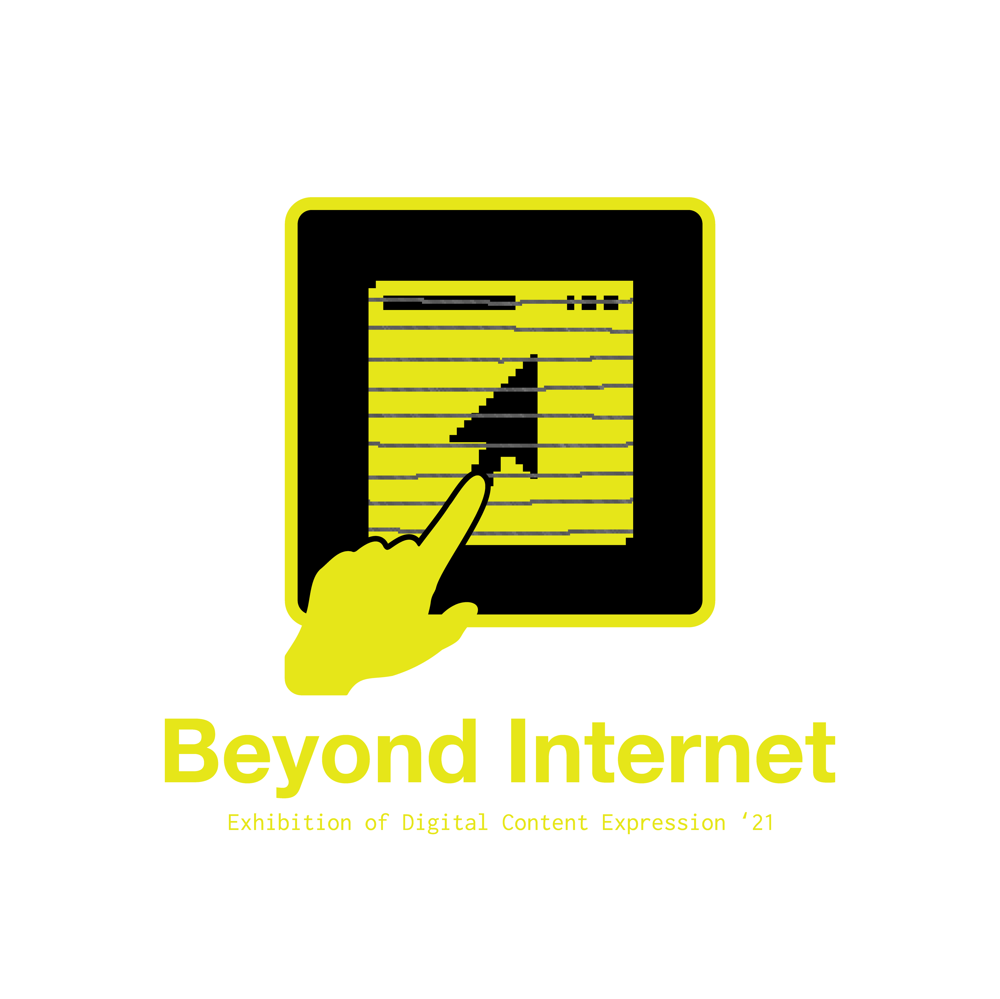

# digital-content-2021

筑波大学情報学群情報メディア創成学類の授業ディジタルコンテンツ表現実習のWebサイトのレポジトリです。

本ページはディスプレイに映し出されているWebサイトの動画をライブ配信しており、その動画が実際のWebページとしてクリックできるというような大変ややこしい仕掛けになっています。

その機能を実装するために、CSS 3d transformを用いたキャリブレーション機能などが実装されています。

現在もライブ配信のアーカイブを使ってWebサイトを視聴することができます。ぜひご覧下さい。
[https://digicon.mast.tsukuba.ac.jp/2021](https://digicon.mast.tsukuba.ac.jp/2021)

## 動作の様子

## クレジット

| 担当  | 名前                                  | 
|-----|-------------------------------------|
| Producer | 浪川洪作                                |
| Director | 梅津友翔                                |
| Web | 西村純, 内田大智, 山浦一輝, 角田陸                |
| Design | 平戸航之介, 北岡直紀, 野渡蒼美, 永石昂大, 岡村美紀       |
| SetUp & Install | 猪瀬暖基, 小西智樹, 土佐凛斗, 永倉昂暉, 櫻井澄香, 芳賀 郁弥 | 
| Advertisement | 鈴木紫琉, 横山拓巳, 福永将也                    |
| Teacher | 落合陽一                                |
| TA | 鳥居万椰                                | 
| 再展示 | 浪川洪作, 猪瀬暖基, 内田大智, 西村純, 小西智樹         |

短い期間で僕のわがままで特殊な実装をしてくれたWebチームの純くん、たいち、山浦さん、角田には感謝してもしきれないです。

また、デザインを仕上げてくれたのすけ、いい感じのロゴを作ってくれたきたちょくをはじめとしたデザインチームもありがとうございました。

さらに、展示の部分で設営をとても頑張ってくれた猪瀬やともきをはじめとした皆さんもありがとうございました。

